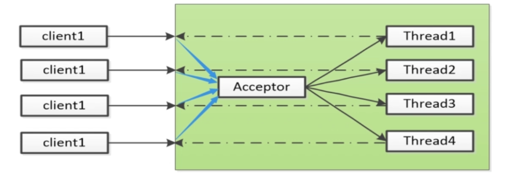
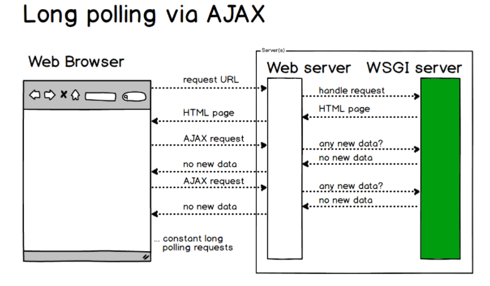
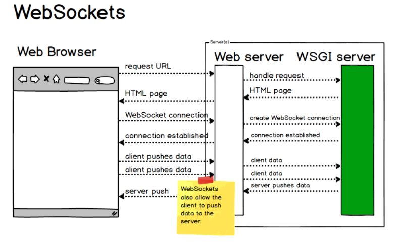

# Netty之WebSocket编程实战

## 一、Netty初介绍

### 1.1 什么是Netty？

- 高性能 事件驱动、异步非阻塞；
- 基于NIO的客户端、服务端编程框架；
- 稳定性和 伸缩性；

### 1.2 Netty使用场景

- 高性能领域；
- 多线程并发领域；
- 异步通信领域；

### 1.3 不选择Java原生NIO编程的原因

1. NIO的类库和API繁杂，使用麻烦，你需要熟练掌握Selector、ServerSocketChannel、SocketChannel、ByteBuffer等
2. 需要具备其它的额外技能做铺垫，例如熟悉Java多线程编程，因为NIO编程涉及到Reactor模式，你必须对多线程和网路编程非常熟悉，才能编写出高质量的NIO程序
3. 可靠性能力补齐，工作量和难度都非常大。例如客户端面临断连重连、网络闪断、半包读写、失败缓存、网络拥塞和异常码流的处理等等，NIO编程的特点是功能开发相对容易，但是可靠性能力补齐工作量和难度都非常大
4. JDK NIO的BUG，例如臭名昭著的epoll bug，它会导致Selector空轮询，最终导致CPU占用100%。官方声称在JDK1.6版本的update18修复了该问题，但是直到JDK1.7版本该问题仍旧存在，只不过该bug发生概率降低了一些而已，它并没有被根本解决。该BUG以及与该BUG相关的问题单如下：
   - [http://bugs.java.com/bugdatabase/view_bug.do?bug_id=6403933](https://www.moregeek.xyz/go?go=aHR0cDovL2J1Z3MuamF2YS5jb20vYnVnZGF0YWJhc2Uvdmlld19idWcuZG8/YnVnX2lkPTY0MDM5MzM=)
   - [http://bugs.java.com/bugdatabase/view_bug.do?bug_id=2147719](https://www.moregeek.xyz/go?go=aHR0cDovL2J1Z3MuamF2YS5jb20vYnVnZGF0YWJhc2Uvdmlld19idWcuZG8/YnVnX2lkPTIxNDc3MTk=)

### 1.4 Netty的优势


Netty是业界最流行的NIO框架之一，它的健壮性、功能、性能、可定制性和可扩展性在同类框架中都是首屈一指的，它已经得到成百上千的商用项目验证，例如Hadoop的RPC框架avro使用Netty作为底层通信框架。很多其它业界主流的RPC框架，也使用Netty来构建高性能的异步通信能力。

通过对Netty的分析，我们将它的优点总结如下：

1. API使用简单，开发门槛低；
2. 功能强大，预置了多种编解码功能，支持多种主流协议；
3. 定制能力强，可以通过ChannelHandler对通信框架进行灵活的扩展；
4. 性能高，通过与其它业界主流的NIO框架对比，Netty的综合性能最优；
5. 成熟、稳定，Netty修复了已经发现的所有JDK NIO BUG，业务开发人员不需要再为NIO的BUG而烦恼；
6. 社区活跃，版本迭代周期短，发现的BUG可以被及时修复，同时，更多的新功能会被加入；
7. 经历了大规模的商业应用考验，质量已经得到验证。在互联网、大数据、网络游戏、企业应用、电信软件等众多行业得到成功商用，证明了它可以完全满足不同行业的商业应用。

正是因为这些优点，Netty逐渐成为Java NIO编程的首选框架。


## 二、说一说IO通信

### 2.1 BIO通信

BIO即同步阻塞模式一请求一应答的通信模型，该模型最大的问题就是缺乏弹性伸缩能力，当客户端并发访问量增加后，服务端的线程个数和客户端并发访问数呈1：1的正比关系，由于线程是JAVA虚拟机非常宝贵的系统资源，当线程数膨胀之后，系统的性能将急剧下降，随着并发访问量的继续增大，系统会发生线程堆栈溢出、创建新线程失败等问题，并最终导致进程宕机或者僵死，不能对外提供服务。

**BIO的服务端通信模型：**

- 采用BIO通信模型的服务端，通常由一个独立的Acceptor线程负责监听客户端的连接
- 当接收到客户端的连接请求后，会为每一个客户端请求创建新的线程进行请求的处理
- 处理完成后通过输出流返回信息给客户端，响应完成后销毁线程
- 典型的一请求一应答的通信模型
- 缺点：缺乏弹性伸缩能力

一个线程处理一个Socket连接，因为Java Socket是通过InputStream和OutputStream来进行网络读写操作，而这俩个的读写都是阻塞模式，所以当某个Socket链路的读写操作没有完成时，排在后面的Socket连接是无法得到处理的，长时间的等待可能会导致超时，因此在同步阻塞模式下，通常会采用一个Socket链路独占一个线程的模型。

**BIO通信模型图：**



### 2.2 伪异步IO通信（BIO优化版本）

为了解决同步阻塞IO（BIO）所面临的一个链路需要一个线程处理的问题，后来有人对它的线程模型进行了优化，后端通过一个线程池来处理多个客户端的请求接入，形成客户端个数M：线程池最大线程数N的比例关系，其中M可以远远大于N，通过线程池可以灵活的调配线程资源，设置线程的最大值，防止由于海量并发接入导致线程耗尽。

**伪异步IO通信特性：**

- 采用线程池和任务队列实现
- 线程池负责连接
- M请求N应答
- 线程池阻塞

当有新的客户端接入的时候，将客户端的Socket封装成一个Task（该任务实现java.lang.Runnable接口）投递到后端的线程池中进行处理,JDK的线程池维护一个消息队列和N个活跃线程对消息队列中的任务进行处理。由于线程池可以设置消息队列的大小和最大线程数，因此，它的资源占用是可控的，无论多少个客户端并发访问，都不会导致资源的耗尽和宕机。

但是伪异步IO通信也有其缺陷，当有大量客户端请求的时候，随着并发访问量的增长，伪异步IO就会造成线程池阻塞。

**伪异步IO通信模型图：**


### 2.3 NIO通信

NIO是非阻塞IO（Non-block IO），也有人称之为New IO，因为它相对于之前的IO类库是新增的，所以被称为New IO，这是它的官方叫法。它是在 JDK 1.4 中引入的。NIO 弥补了原来同步阻塞I/O 的不足，它在标准 Java 代码中提供了高速的、面向块的 I/O。通过定义包含数据的类，以及通过以块的形式处理这些数据，NIO 不用使用本机代码就可以利用底层优化，这是原来的 I/O 包所无法做到的。

#### (1) NIO之缓冲区Buffer介绍

> 我们首先介绍缓冲区（Buffer）的概念，Buffer 是一个对象， 它包含一些要写入或者要读出的数据。 在 NIO类库 中加入 Buffer 对象，体现了新库与原 I/O 的一个重要区别。在面向流的 I/O 中，我们将数据直接写入或者将数据直接读到 Stream 对象中。
>
> 在 NIO 库中，所有数据都是用缓冲区进行处理的。在读取数据时，它是直接读到缓冲区中；在写入数据时，它也是写入到缓冲区中。任何时候访问 NIO 中的数据，我们都是通过缓冲区进行读写操作。
>
> 缓冲区实质上是一个数组。通常它是一个字节数组（ByteBuffer），也可以使用其它种类的数组。但是一个缓冲区不仅仅是一个数组，缓冲区提供了对数据的结构化访问，及维护读写位置（limit）等信息。
>
> 最常用的缓冲区是ByteBuffer，一个ByteBuffer提供了一组功能用于操作byte数组。除了ByteBuffer，还有其它的一些缓冲区，事实上，每一种Java基本类型(除了Boolean类型)都对应有一种缓冲区，如下所示：
>
> - ByteBuffer：字节缓冲区
> - CharBuffer：字符缓冲区
> - ShortBuffer：短整型缓冲区
> - IntBuffer：整型缓冲区
> - LongBuffer：长整型缓冲区
> - FloatBuffer：浮点型缓冲区
> - DoubleBuffer：双精度浮点型缓冲区

#### (2) NIO之通道Channel

> Channel是一个通道，可以通过它读取和写入数据，它就像自来水管一样，网络数据通过Channel读取和写入。通道与流的不同之处在于通道是双向的。而流只是在一个方向上移动(一个流必须是 InputStream 或者 OutputStream 的子类)，而通道可以用于读、写或者同时用于读写。

#### (3) NIO之多路复用器Selector

> 它是JAVA NIO编程的基础，熟练的掌握Selector对于掌握NIO编程至关重要。多路复用器提供选择已经就绪的任务的能力。简单来讲，Selector会不断的轮询注册在其上的Channel，如果某个Channel上面有新的TCP连接接入、读和写事件，这个Channel就处于就绪状态，会被Selector轮询出来，然后通过SelectionKey可以获取就绪Channel的集合进行后续的IO操作。
>
> 一个多路复用器Selector可以同时轮询多个Channel，由于JDK使用了epoll()代替传统的select实现，所以它并没有最大连接句柄1024/2048的限制。这也就意味着只需要一个线程负责Selector的轮询，就可以接入成千上万的客户端，这的确是一个巨大的改进。

### 2.4 AIO通信

与NIO不同，AIO需要一个连接注册读写事件和回调方法，当进行读写操作时，只须直接调用API的read或write方法即可。这两种方法均为异步的，对于读操作而言，当有流可读取时，操作系统会将可读的流传入read方法的缓冲区，并通知应用程序；对于写操作而言，当操作系统将write方法传递的流写入完毕时，操作系统主动通知应用程序。 即可以理解为，read/write方法都是异步的，完成后会主动调用回调函数。


AIO异步通道提供了两种方式获取操作结果：

1. 通过`java.util.concurrent.Future`类来表示异步操作的结果
2. 在执行异步操作的时候传入一个`java.nio.channels.CompletionHandler`接口的实现类作为操作完成的回调。 AIO的异步套接字通道是真正的异步非阻塞IO，对应于UNIX网络编程中的事件驱动IO(AIO)，它不需要通过多路复用器(Selector)对注册的通道进行轮询操作即可实现异步读写，从而简化了NIO的编程模型。


**AIO通信的特性：**

- 连接注册读写事件和回调函数
- 读写方法异步
- 主动通知程序

### 2.5 四种IO通信对比

| -                  | 同步阻塞I/O（BIO） | 伪异步I/O               | 非阻塞I/O（NIO）                     | 异步I/O（AIO）                            |
| :----------------- | :----------------- | :---------------------- | :----------------------------------- | :---------------------------------------- |
| 客户端个数：IO线程 | 1 : 1              | M : N（其中M可以大于N） | M : 1（1个IO线程处理多个客户端连接） | M : 0（不需要启动额外的IO线程，被动回调） |
| IO类型（阻塞）     | 阻塞IO             | 阻塞IO                  | 非阻塞IO                             | 非阻塞IO                                  |
| IO类型（同步）     | 同步IO             | 同步IO                  | 同步IO（IO多路复用）                 | 异步IO                                    |
| API使用难度        | 简单               | 简单                    | 非常复杂                             | 复杂                                      |
| 调试难度           | 简单               | 简单                    | 复杂                                 | 复杂                                      |
| 可靠性             | 非常差             | 差                      | 高                                   | 高                                        |
| 吞吐量             | 低                 | 中                      | 高                                   | 高                                        |

## 三、WebSocket初介绍

### 3.1 WebSocket是什么

- WebSocket 是一种网络通信协议。RFC6455 定义了它的通信标准。

- WebSocket 是 HTML5 开始提供的一种在单个 TCP 连接上进行全双工通讯的协议。

- WebSocket 是解决客户端与服务端实时通信而产生的技术

### 3.2 为什么需要WebSocket？

了解计算机网络协议的人，应该都知道：HTTP 协议是一种无状态的、无连接的、单向的应用层协议。它采用了请求/响应模型。通信请求只能由客户端发起，服务端对请求做出应答处理。这种通信模型有一个弊端：HTTP 协议无法实现服务器主动向客户端发起消息。

这种单向请求的特点，注定了如果服务器有连续的状态变化，客户端要获知就非常麻烦。大多数 Web 应用程序将通过频繁的异步JavaScript和XML（AJAX）请求实现长轮询。轮询的效率低，非常浪费资源（因为必须不停连接，或者 HTTP 连接始终打开）。



因此，工程师们一直在思考，有没有更好的方法。WebSocket 就是这样发明的。WebSocket 连接允许客户端和服务器之间进行全双工通信，以便任一方都可以通过建立的连接将数据推送到另一端。WebSocket 只需要建立一次连接，就可以一直保持连接状态。这相比于轮询方式的不停建立连接显然效率要大大提高。




**WebSocket建立连接步骤：**

- 客户端发起握手请求
- 服务端响应请求
- 连接建立

**WebSocket的优点：**

- 节省通信开销
- 服务器主动传送数据给客户端
- 实时通讯，适合实现聊天室等功能

### 3.3 WebSocket生命周期

1. 打开事件：@OnOpen 此事件发生在端点上建立新连接时并且在任何其他事件发生之前
2. 消息事件：@OnMessage 此事件接收WebSocket对话中另一端发送的消息。
3. 错误事件：@OnError 此事件在WebSocket连接或者端点发生错误时产生
4. 关闭事件：@OnClose 此事件表示WebSocket端点的连接目前部分地关闭，它可以由参与连接的任意一个端点发出

> @OnOpen 指示当此端点建立新的连接时调用此方法。此事件伴随着三部分信息：WebSocket Session对象，用于表示已经建立好的连接；配置对象（EndpointConfig的实例），包含了用来配置端点的信息；一组路径参数，用于打开阶段握手时WebSocket端点入站匹配URI。@OnOpen注解的方法是没有任何返回值的公有方法，这些方法有一个可选的Session参数、一个可选的EndpointConfig参数，以及任意数量的被@PathParam注解的String参数。


> @OnMessage 处理入站的消息。java培训机构里面是这样讲解的，连接上的消息将以3种基本形式抵达：文本消息、二进制消息或者Pong消息。最基本的形式是选择使用带String参数的方法来处理文本消息；使用ByteBuffer或者是byte[]参数的方法来处理二进制文本；若你的消息仅仅是处理Pong消息，则可以使用Java WebSocket API中的PongMessage接口的一个实例。当然可以使用一个boolean型参数表示对到来的消息进行分片。当boolean型参数值为false时，表示后续还有整个文本消息序列中的更多消息分片的到来，当设置为true时，表示当前消息是消息分片中最后一个分片。消息的处理还有很多选项，比如使用JavaI/O，甚至可以让WebSocket实现把入站消息转换成自己选择的对象。这个将在消息通信基础中提到，WebSocket应用一般是异步的双向消息。因此通过@OnMessage注解的此类方法上有一个额外选项：方法可以有返回值或者返回为空。当使用@OnMessage注解的方法有返回类型时，WebSocket实现立即将返回值作为消息返回给刚刚在方法中处理的消息的发送者。


> @OnError 可以处理WebSocket实现处理入站消息时发生的任何异常。处理入站消息时，可能会发生3中基本的错误类型。首先，WebSocket实现产生的错误可能会发生，这些异常属于SessionException类型，其次，错误可能会发生在当WebSocket实现试图将入站消息解码成开发人员所需要的对象时。此类错误都是DecodeException类型。最后是由WebSocket端点的其他方法产生的运行时错误。WebSocket实现将记录WebSocket端点操作过程中产生的任何异常。


> @OnClose 它对于在WebSocket连接关闭时做其他的通用清理工作。@OnClose 可以用来注解多种不同类型的方法来关闭事件。


## 四、使用Netty实现WebSocket服务器

### 4.1 依赖


### 4.2 接收/处理/响应 客户端websocket请求的核心业务处理类

```java
package com.lcz.netty;

import io.netty.buffer.ByteBuf;
import io.netty.buffer.Unpooled;
import io.netty.channel.ChannelFuture;
import io.netty.channel.ChannelFutureListener;
import io.netty.channel.ChannelHandlerContext;
import io.netty.channel.SimpleChannelInboundHandler;
import io.netty.handler.codec.http.DefaultFullHttpResponse;
import io.netty.handler.codec.http.FullHttpRequest;
import io.netty.handler.codec.http.HttpResponseStatus;
import io.netty.handler.codec.http.HttpVersion;
import io.netty.handler.codec.http.websocketx.*;
import io.netty.util.CharsetUtil;

import java.util.Date;

/**
 * @author : codingchao
 * @date : 2022-01-18 16:50
 * @Description: 接收/处理/响应 客户端websocket请求的核心业务处理类
 **/

public class MyWebSocketHandler extends SimpleChannelInboundHandler<Object> {

    private WebSocketServerHandshaker handshaker;
    private static final String WEB_SOCKET_URL = "ws://localhost:8888/websocket";
    //客户端与服务端创建连接的时候调用
    @Override
    public void channelActive(ChannelHandlerContext ctx) throws Exception {
        NettyConfig.group.add(ctx.channel());
        System.out.println("客户端与服务端连接开启...");
    }

    //客户端与服务端断开连接的时候调用
    @Override
    public void channelInactive(ChannelHandlerContext ctx) throws Exception {
        NettyConfig.group.remove(ctx.channel());
        System.out.println("客户端与服务端连接关闭...");
    }

    //服务端接收客户端发送过来的数据结束之后调用
    @Override
    public void channelReadComplete(ChannelHandlerContext ctx) throws Exception {
        ctx.flush();
    }

    //工程出现异常的时候调用
    @Override
    public void exceptionCaught(ChannelHandlerContext ctx, Throwable cause) throws Exception {
        cause.printStackTrace();
        ctx.close();
    }

    //服务端处理客户端websocket请求的核心方法
    @Override
    protected void messageReceived(ChannelHandlerContext context, Object msg) throws Exception {
        //处理客户端向服务端发起http握手请求的业务
        if (msg instanceof FullHttpRequest) {
            handHttpRequest(context,  (FullHttpRequest)msg);
        }else if (msg instanceof WebSocketFrame) { //处理websocket连接业务
            handWebsocketFrame(context, (WebSocketFrame)msg);
        }
    }

    /**
     * 处理客户端与服务端之前的websocket业务
     * @param ctx
     * @param frame
     */
    private void handWebsocketFrame(ChannelHandlerContext ctx, WebSocketFrame frame){
        //判断是否是关闭websocket的指令
        if (frame instanceof CloseWebSocketFrame) {
            handshaker.close(ctx.channel(), (CloseWebSocketFrame)frame.retain());
        }
        //判断是否是ping消息
        if (frame instanceof PingWebSocketFrame) {
            ctx.channel().write(new PongWebSocketFrame(frame.content().retain()));
            return;
        }

        //判断是否是二进制消息，如果是二进制消息，抛出异常
        if( ! (frame instanceof TextWebSocketFrame) ){
            System.out.println("目前我们不支持二进制消息");
            throw new RuntimeException("【"+this.getClass().getName()+"】不支持消息");
        }
        //返回应答消息
        //获取客户端向服务端发送的消息
        String request = ((TextWebSocketFrame) frame).text();
        System.out.println("服务端收到客户端的消息====>>>" + request);
        TextWebSocketFrame tws = new TextWebSocketFrame(new Date().toString()
                + ctx.channel().id()
                + " ===>>> "
                + request);
        //群发，服务端向每个连接上来的客户端群发消息
        NettyConfig.group.writeAndFlush(tws);
    }
    /**
     * 处理客户端向服务端发起http握手请求的业务
     * @param ctx
     * @param req
     */
    private void handHttpRequest(ChannelHandlerContext ctx, FullHttpRequest req){
        if (!req.getDecoderResult().isSuccess()
                || ! ("websocket".equals(req.headers().get("Upgrade")))) {
            sendHttpResponse(ctx, req,
                    new DefaultFullHttpResponse(HttpVersion.HTTP_1_1, HttpResponseStatus.BAD_REQUEST));
            return;
        }
        WebSocketServerHandshakerFactory wsFactory = new WebSocketServerHandshakerFactory(
                WEB_SOCKET_URL, null, false);
        handshaker = wsFactory.newHandshaker(req);
        if (handshaker == null) {
            WebSocketServerHandshakerFactory.sendUnsupportedWebSocketVersionResponse(ctx.channel());
        }else{
            handshaker.handshake(ctx.channel(), req);
        }
    }

    /**
     * 服务端向客户端响应消息
     * @param ctx
     * @param req
     * @param res
     */
    private void sendHttpResponse(ChannelHandlerContext ctx, FullHttpRequest req,
                                  DefaultFullHttpResponse res){
        if (res.getStatus().code() != 200) {
            ByteBuf buf = Unpooled.copiedBuffer(res.getStatus().toString(), CharsetUtil.UTF_8);
            res.content().writeBytes(buf);
            buf.release();
        }
        //服务端向客户端发送数据
        ChannelFuture f = ctx.channel().writeAndFlush(res);
        if (res.getStatus().code() != 200) {
            f.addListener(ChannelFutureListener.CLOSE);
        }
    }
}

```

```java
package com.lcz.netty;

/**
 * @author : codingchao
 * @date : 2022-01-18 16:53
 * @Description:初始化连接时候的各个组件
 **/

import io.netty.channel.ChannelInitializer;
import io.netty.channel.socket.SocketChannel;
import io.netty.handler.codec.http.HttpObjectAggregator;
import io.netty.handler.codec.http.HttpServerCodec;
import io.netty.handler.stream.ChunkedWriteHandler;

public class MyWebSocketChannelHandler extends ChannelInitializer<SocketChannel> {

    @Override
    protected void initChannel(SocketChannel e) throws Exception {
        e.pipeline().addLast("http-codec", new HttpServerCodec());
        e.pipeline().addLast("aggregator", new HttpObjectAggregator(65536));
        e.pipeline().addLast("http-chunked", new ChunkedWriteHandler());
        e.pipeline().addLast("handler", new MyWebSocketHandler());
    }

}
```

```java
package com.lcz.netty;

import io.netty.channel.group.ChannelGroup;
import io.netty.channel.group.DefaultChannelGroup;
import io.netty.util.concurrent.GlobalEventExecutor;

/**
 * @author : codingchao
 * @date : 2022-01-18 16:13
 * @Description: 存储整个工程的全局配置
 **/
public class NettyConfig {
    /**
     * 存储接入的客户端的channel对象
     */
    public static ChannelGroup group = new DefaultChannelGroup(GlobalEventExecutor.INSTANCE);
}

```


### 4.3 主函数

```java
package com.lcz.netty;

import io.netty.bootstrap.ServerBootstrap;
import io.netty.channel.Channel;
import io.netty.channel.EventLoopGroup;
import io.netty.channel.nio.NioEventLoopGroup;
import io.netty.channel.socket.nio.NioServerSocketChannel;

/**
 * @author : codingchao
 * @date : 2022-01-18 16:55
 * @Description:
 **/
public class Main {
    public static void main(String[] args) {
        EventLoopGroup bossGroup = new NioEventLoopGroup();
        EventLoopGroup workGroup = new NioEventLoopGroup();
        try {
            ServerBootstrap b = new ServerBootstrap();
            b.group(bossGroup, workGroup);
            b.channel(NioServerSocketChannel.class);
            b.childHandler(new MyWebSocketChannelHandler());
            System.out.println("服务端开启等待客户端连接....");
            Channel ch = b.bind(8888).sync().channel();
            ch.closeFuture().sync();

        } catch (Exception e) {
            e.printStackTrace();
        }finally{
            //优雅的退出程序
            bossGroup.shutdownGracefully();
            workGroup.shutdownGracefully();
        }
    }
}

```

### 4.4 展示


