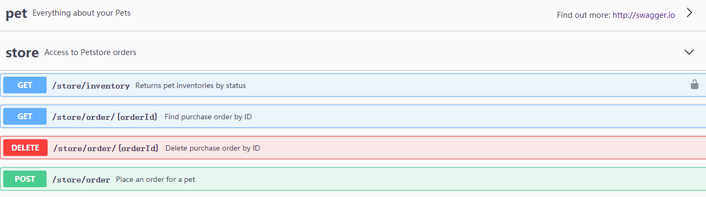
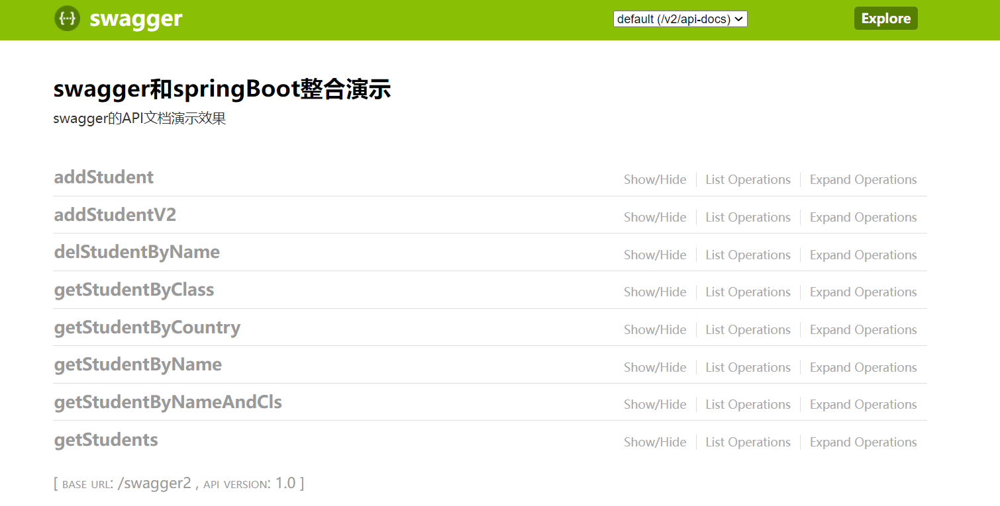
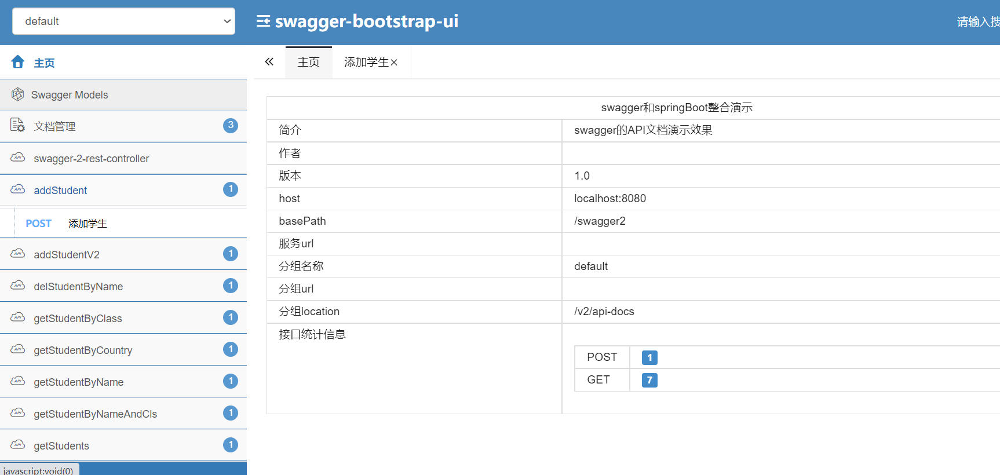

# 手把手教你Swagger接口文档神器使用

> | 相关内容                                                     | 地址                                                         |
> | ------------------------------------------------------------ | ------------------------------------------------------------ |
> | [Swagger官方文档](https://link.juejin.cn?target=https%3A%2F%2Fswagger.io%2Fdocs%2Fspecification%2F2-0%2Fbasic-structure) | [swagger.io/docs/specif…](https://link.juejin.cn?target=https%3A%2F%2Fswagger.io%2Fdocs%2Fspecification%2F2-0%2Fbasic-structure) |
> | [Swagger常用注解](https://link.juejin.cn?target=https%3A%2F%2Fblog.csdn.net%2Fweixin_42526326%2Farticle%2Fdetails%2F119824857) | [blog.csdn.net/weixin_4252…](https://link.juejin.cn?target=https%3A%2F%2Fblog.csdn.net%2Fweixin_42526326%2Farticle%2Fdetails%2F119824857) |
> | [Swagger2常用注解](https://link.juejin.cn?target=https%3A%2F%2Fblog.csdn.net%2Fweixin_42526326%2Farticle%2Fdetails%2F119963866) | [blog.csdn.net/weixin_4252…](https://link.juejin.cn?target=https%3A%2F%2Fblog.csdn.net%2Fweixin_42526326%2Farticle%2Fdetails%2F119963866) |
> | [Swagger3常用注解](https://link.juejin.cn?target=https%3A%2F%2Fblog.csdn.net%2Fweixin_42526326%2Farticle%2Fdetails%2F119965092) | [blog.csdn.net/weixin_4252…](https://link.juejin.cn?target=https%3A%2F%2Fblog.csdn.net%2Fweixin_42526326%2Farticle%2Fdetails%2F119965092) |

## 一、Swagger初介绍

### 1.什么是Swagger？

- 一款RESTFUL接口的文档在线生成软件；
- 一款RESTFUL接口的功能测试软件；
- 一座前后端开发者沟通的桥梁；

> 其余：
>
> - 围绕OAS构建RESTful文档；
> - 动态生成接口定义文档；
> - 易用免费且开源

### 2.Swagger解决的问题

- 解决后端开发者WIKI的维护问题；
- 解决前端和后端开发者沟通问题；
- 提高测试开发者的效率问题；

### 3.Swagger工具介绍

- Swagger Editor - 开源编辑器（类似markdown,可以在线编辑）
- Swagger UI - 呈现可交互在线文档
- Swagger Codegen - 生成调用代码的工具

### 4.Swagger用处

- 支持页面展示接口定义，节省专门编写接口文档的时间
- 基于代码生成文档，规避接口文档老旧问题
- 支持接口调试，降低开发阶段调试成本

### 5.Swagger跨语言

- 支持go和php语言的go-swagger和swagger-php
- 支持java语言的springfox
- 支持js和node语言的swagger-node和swagger-js

## 二、Swagger深体验

### 1.swagger介绍

swagger[官网地址](https://swagger.io/)：` https://swagger.io `，从官网看出，它是一个规范 （OpenAPI Specification，OAS） 和完整的框架（如编辑器 Swagger Editor ，显示组件 Swagger Editor ，代码生成 Swagger Codegen ），用于生成、描述、调用和可视化 RESTful 风格的 Web 服务。既然是规范，它定义了一系列与接口描述相关的规则，如文档格式，文件结构，数据类型，请求方法等等，可[参考官方规范说明](https://swagger.io/specification/v2/)：` https://swagger.io/specification/v2/ `，文件设计和编写时一般是 YAML格式 （方便编写），在传输时则会使用JSON（通用性强）。有了接口描述文件后，需要进行友好显示，swagger提供了[Swagger-UI](https://swagger.io/tools/swagger-ui/)：` https://swagger.io/tools/swagger-ui/ `。这个组件的作用就是把已经按规范写好的yaml文件，通过接口文档形式显示。我们可以下载这个组件本地运行，它是一个静态网页，放到web容器（如apache，nginx）来运行。也可以使用官网的在线版本。如下： 



至此，我们知道使用swagger进行接口文档编写步骤是：（1）编写符合OAS的接口文件，（2）使用swagger-ui进行显示。

### 2.springfox、swagger与spring boot之间的关系

从前面可知，编写符合OAS的接口文件还是得手工编写，swagger-ui显示也不方便（需要人工离线部署或使用在线服务），现在java领域的web开发，基本都使用springmvc开发，有没有更方便的方式来结合swagger进行接口文件编写，而不需要 手工编写，减少工作量？

牛人` Marty Pitt`编写了一个基于Spring的组件[swagger-springmvc](https://github.com/martypitt/swagger-springmvc-example):`https://github.com/martypitt/swagger-springmvc-example`，用于将swagger集成到springmvc中来。springfox则是从这个组件发展而来，它可以基于spring自动生成JSON的API文档，现在通过`https://github.com/martypitt/swagger-springmvc/`地址会直接跳转到[springfox的github页面](https://github.com/springfox/springfox)，它的[官网](http://springfox.io/)：`http://springfox.io`。当前springfox已经是发布了多个版本，本文使用的是`springfox-swagger2`的2.7.0的版本。对于swagger-ui，它也提供了`springfox-swagger-ui`，集成接口文档显示页面。这样，前面swagger的两个步骤都可以自动完成。而现在我们开发java web应用基本都是使用springboot进行开发，使用它的自动配置与注解，更加方便开发。因此，基于swagger的规范，使用springfox的组件（swagger2和swagger-ui），结合springboot，可以让接口文档变得非常简单，有效。总的来说，springfox是对swagger规范的在springmvc和springboot开发中的自动化实现。本文后续就是以这种方式进行具体的使用描述。


## 三、SpringBoot+Swagger构建接口文档

### 1.spring boot示例工程构建

（1） 创建项目：通过[ Spring Initializr 页面](https://start.spring.io/)生成一个空 Spring Boot 项目，添加web依赖。

```xml
<dependency>
    <groupId>org.springframework.boot</groupId>
    <artifactId>spring-boot-starter-web</artifactId>
</dependency>
```

（2）编写示例接口：

- 首先添加几个通用包：vo，controller，service，model，exception，分别存放视图层模型，控制层，服务层，数据模型层，异常对象等代码。
- 示例数据模型是User，对应有UserController，UserService，统一返回视图模型ResponseResult，统一异常类UniRuntimeException。
- 针对用户管理，使用restful风格的接口，定义了对用户的增删改查，对应(POST,DELETE,PUT,GET请求)，如下：

```java
@RestController
@RequestMapping("/users")
public class UserController {
    @Autowired
    private UserService userService;
    
    /**
     * 查询单个用户
     */
    @GetMapping("/{userId}")
    public ResponseResult getUserById(@PathVariable long userId) {...}
    /**
     * 查询多个用户
     */
    @GetMapping()
    public ResponseResult getUsers() {...}
    /**
     * 添加多个用户
     */
    @PostMapping()
    public ResponseResult addUsers(@RequestBody List<User> users) {...}
    /**
     * 添加单个用户
     */
    @PostMapping("/user")
    public ResponseResult addUser(@RequestBody User user) {...}
    /**
     * 更新单个用户
     */
    @PutMapping("/user")
    public ResponseResult updateUser(@RequestBody User user) {...} 
    /**
     * 删除单个用户
     */
    @DeleteMapping("/user")
    public ResponseResult deleteUser(long userId) {...}
}
```

### 2.引入swagger2与基本配置

为了可以自动化生成符合swagger的接口描述文件，需要添加springfox的依赖，如下：

```xml
<dependency>
    <groupId>io.springfox</groupId>
    <artifactId>springfox-swagger2</artifactId>
    <version>2.7.0</version>
</dependency>
<dependency>
    <groupId>io.springfox</groupId>
    <artifactId>springfox-swagger-ui</artifactId>
    <version>2.7.0</version>
</dependency>
<dependency>
    <groupId>com.github.xiaoymin</groupId>
    <artifactId>swagger-bootstrap-ui</artifactId>
    <version>1.8.7</version>
</dependency>
```

**配置swagger文件**

```java
package com.lcz.springboot_swagger.configuration;

import com.github.xiaoymin.swaggerbootstrapui.annotations.EnableSwaggerBootstrapUI;
import com.google.common.base.Predicates;
import org.springframework.beans.factory.annotation.Value;
import org.springframework.context.annotation.Bean;
import org.springframework.context.annotation.Configuration;
import org.springframework.context.annotation.Profile;
import org.springframework.web.servlet.config.annotation.ResourceHandlerRegistry;
import org.springframework.web.servlet.config.annotation.WebMvcConfigurerAdapter;
import springfox.documentation.builders.ApiInfoBuilder;
import springfox.documentation.builders.PathSelectors;
import springfox.documentation.builders.RequestHandlerSelectors;
import springfox.documentation.service.*;
import springfox.documentation.spi.DocumentationType;
import springfox.documentation.spi.service.contexts.SecurityContext;
import springfox.documentation.spring.web.plugins.Docket;
import springfox.documentation.swagger2.annotations.EnableSwagger2;

import java.util.ArrayList;
import java.util.Arrays;
import java.util.List;

/**
 * @author : codingchao
 * @date : 2022-01-22 15:25
 * @Description:
 **/
@Configuration
@EnableSwagger2
@EnableSwaggerBootstrapUI
@Profile({"dev", "test", "pre", "prod"})
public class Swagger2UiConfiguration extends WebMvcConfigurerAdapter {
    /**
     * 是否开启swagger配置，生产环境需关闭
     */
    @Value("${swagger2.enable}")
    private boolean swagger2Enable;

    /**
     * 创建API
     * http:IP:端口号/swagger-ui.html 原生地址
     * http:IP:端口号/doc.html bootStrap-UI地址
     */
    @Bean
    public Docket api() {
        return new Docket(DocumentationType.SWAGGER_2)
                // 用来创建该API的基本信息，展示在文档的页面中（自定义展示的信息）
                .enable(swagger2Enable)
                // 绑定swagger-ui的展示内容
                .apiInfo(apiInfo())
                // 设置哪些接口暴露给Swagger展示
                .select()
                // 绑定扫描的类
                .apis(Predicates.not(RequestHandlerSelectors.basePackage("org.springframework.boot")))
                .build();
        //       .securitySchemes(securitySchemes())
       //        .securityContexts(securityContexts());
    }

    /**
     * 指定swagger2 ui的显示格式
     * @return
     */
    private ApiInfo apiInfo() {
        return new ApiInfoBuilder()
                .title("swagger和springBoot整合演示")
                .description("swagger的API文档演示效果")
                .version("1.0")
                .build();
        //                .securitySchemes(securitySchemes())
//                .securityContexts(securityContexts());
    }

    @Override
    public void addResourceHandlers(ResourceHandlerRegistry registry) {
        registry.addResourceHandler("swagger-ui.html").addResourceLocations("classpath:/META-INF/resources/");
        registry.addResourceHandler("/webjars/**").addResourceLocations("classpath:/META-INF/resources/webjars/");
    }

    List<SecurityReference> defaultAuth() {
        AuthorizationScope authorizationScope = new AuthorizationScope("global","accessEverything");
        AuthorizationScope[] authorizationScopes = new AuthorizationScope[1];
        authorizationScopes[0] = authorizationScope;
        return Arrays.asList(new SecurityReference("Authorization", authorizationScopes));
    }


    private List<SecurityScheme> securitySchemes() {
        List<SecurityScheme> list = new ArrayList<>();
        list.add(new BasicAuth("basicAuth"));
        list.add(new ApiKey("write_token","write_token","header"));
        list.add(new ApiKey("read_token","read_token","query"));

        return list;
    }

    private List<SecurityContext> securityContexts() {
        return Arrays.asList(SecurityContext.builder()
                .securityReferences(defaultAuth())
                .forPaths(PathSelectors.any())
                .build()
        );
    }
}

```

**基本配置**

```properties
server.contextPath=/swagger2

## 开启Swagger的Basic认证功能,默认是false,开启功能,默认账号密码是admin/123321
swagger.basic.enable=false
swagger.basic.username=username
swagger.basic.password=123456
swagger.production=false

swagger2.enable=true

```

### 3.业务中配置

经过上面的配置化，我们已经可以灵活构建文档了。但文档的内容还不丰富，对接口的描述不详细，`springfox`把对接口的描述都通过注解的方式来完成，主要包括以下几种注解：

1. 数据模型注解：`@ApiModel`，实体描述；`@ApiModelProperty`，实体属性描述
2. 接口注解：`@ApiOperation`，接口描述；`@ApiIgnore`，忽略此接口
3. 控制器注解：`@Api`，控制器描述
4. 输入参数注解：`@ApiImplicitParams`，接口多个参数；`@ApiImplicitParam`，单个参数；`@ApiParam`，单个参数描述
5. 响应数据注解：`@ResponseHeader`，响应值header；`@ApiResponses`，响应值集；`@ApiResponse`，单个响应值

```java
package com.lcz.springboot_swagger.controller;

import com.lcz.springboot_swagger.model.Student;
import com.sun.org.apache.xpath.internal.operations.Bool;
import io.swagger.annotations.*;
import org.springframework.web.bind.annotation.*;

import java.util.ArrayList;
import java.util.List;
import java.util.stream.Collectors;

/**
 * @author : codingchao
 * @date : 2022-01-22 14:51
 * @Description:
 **/
@Api(value = "Swagger2RestController",description = "学生服务")
@RestController
public class Swagger2RestController {

    /**
     * 组合所有学生的信息
     */
    List<Student> students = new ArrayList<>();
    {
        students.add(new Student("Sajal", "IV", "India"));
        students.add(new Student("Lokesh", "V", "India"));
        students.add(new Student("Kajal", "III", "USA"));
        students.add(new Student("Sukesh", "VI", "USA"));
    }

    /**
     * 返回所有学生信息
     * @return
     */
    @ApiOperation(value = "以列表形式返回学生信息",
            responseContainer="List",
            response = Student.class,
            tags = "getStudents")
    @ApiResponses(value = {
            @ApiResponse(code = 200, message = "Suceess|OK"),
            @ApiResponse(code = 401, message = "not authorized!"),
            @ApiResponse(code = 403, message = "forbidden!!!"),
            @ApiResponse(code = 404, message = "not found!!!") })
    @GetMapping(value = "/getStudents")
    public List<Student> getStudents(){
        return students;
    }

    /**
     * 获取指定姓名的学生
     * @param name
     * @return
     */
    @ApiOperation(value = "获取指定名字的学生",
            response = Student.class,
            tags = "getStudentByName")
    @ApiResponses(value = {
            @ApiResponse(code = 200, message = "Suceess|OK"),
            @ApiResponse(code = 401, message = "not authorized!"),
            @ApiResponse(code = 403, message = "forbidden!!!"),
            @ApiResponse(code = 404, message = "not found!!!") })
    @GetMapping(value = "/getStudentByName/{studentName}")
    public  Student getStudentByName(@RequestParam(value = "studentName") String name){
        return students.stream().filter(x->x.getName().equalsIgnoreCase(name)).collect(Collectors.toList()).get(0);
    }

    /**
     * 获取指定国家的学生
     * @param country
     * @return
     */
    @ApiOperation(value = "获取指定国家的学生",
            responseContainer="List",
            response = Student.class,
            tags = "getStudentByCountry")
    @ApiResponses(value = {
            @ApiResponse(code = 200, message = "Suceess|OK"),
            @ApiResponse(code = 401, message = "not authorized!"),
            @ApiResponse(code = 403, message = "forbidden!!!"),
            @ApiResponse(code = 404, message = "not found!!!") })
    @GetMapping(value = "getStudentByCountry/{country}")
    public List<Student>  getStudentByCountry(@PathVariable(value = "country") String country){
        System.out.println("Searching Student in country : " + country);
        List<Student> studentsByCountry = students.stream().filter(x -> x.getCountry().equalsIgnoreCase(country))
                .collect(Collectors.toList());
        System.out.println(studentsByCountry);
        return studentsByCountry;
    }


    /**
     * 获取指定班级的学生
     * @param cls
     * @return
     */
    @ApiOperation(value = "获取指定班级的学生",
            responseContainer="List",
            response = Student.class,
            tags="getStudentByClass")
    @ApiResponses(value = {
            @ApiResponse(code = 200, message = "Suceess|OK"),
            @ApiResponse(code = 401, message = "not authorized!"),
            @ApiResponse(code = 403, message = "forbidden!!!"),
            @ApiResponse(code = 404, message = "not found!!!") })
    @RequestMapping(value = "/getStudentByClass/{cls}", method = RequestMethod.GET)
    public List<Student> getStudentByClass(@PathVariable(value = "cls") String cls) {
        return students.stream().filter(x -> x.getCls().equalsIgnoreCase(cls)).collect(Collectors.toList());
    }

    /**
     * 添加学生
     * @param student
     * @return
     */
    @ApiOperation(value = "添加学生",
            tags="addStudent")
    @ApiResponses(value = {
            @ApiResponse(code = 200, message = "Suceess|OK"),
            @ApiResponse(code = 401, message = "not authorized!"),
            @ApiResponse(code = 403, message = "forbidden!!!"),
            @ApiResponse(code = 404, message = "not found!!!") })
    @RequestMapping(value = "/addStudent", method = RequestMethod.POST, consumes = {"application/json"}, produces = {"application/json"})
    public Boolean addStudent(@RequestBody Student student){
        return students.add(student);
    }

    /**
     * 添加学生v2
     * @param name
     * @param cls
     * @param country
     * @return
     */
    @ApiOperation(value = "添加学生V2",
            tags="addStudentV2")
    @ApiImplicitParams({
            @ApiImplicitParam(name = "name", value = "姓名", paramType = "query"),
            @ApiImplicitParam(name = "cls", value = "班级", paramType = "query"),
            @ApiImplicitParam(name = "country", value = "国家", paramType = "query")
    })
    @ApiResponses(value = {
            @ApiResponse(code = 200, message = "Suceess|OK"),
            @ApiResponse(code = 401, message = "not authorized!"),
            @ApiResponse(code = 403, message = "forbidden!!!"),
            @ApiResponse(code = 404, message = "not found!!!") })
    @RequestMapping(value = "/addStudentV2", method = RequestMethod.GET)
    public Boolean addStudentV2(@RequestParam String name,
                                @RequestParam String cls,
                                @RequestParam String country) {
        Student student = new Student(name, cls, country);
        return students.add(student);
    }

    /**
     * 查找指定班级指定名字的学生
     * @param name
     * @param cls
     * @return
     */
    @ApiOperation(value = "查找指定班级指定名字的学生", tags = "getStudentByNameAndCls")
    @ApiResponses(value = {
            @ApiResponse(code = 200, message = "Suceess|OK"),
            @ApiResponse(code = 401, message = "not authorized!"),
            @ApiResponse(code = 403, message = "forbidden!!!"),
            @ApiResponse(code = 404, message = "not found!!!") })
    @RequestMapping(value = "getStudentByNameAndCls", method = RequestMethod.GET)
    public Student getStudentByNameAndCls(@RequestParam String name, @RequestParam String cls) {
        return students.stream()
                .filter(x -> x.getCls().equals(cls) && x.getName().equalsIgnoreCase(name))
                .collect(Collectors.toList()).get(0);
    }

    /**
     * 删除指定姓名的学生
     * @param name
     * @return
     */
    @ApiOperation(value = "删除指定名字的学生", tags = "delStudentByName")
    @ApiResponses(value = {
            @ApiResponse(code = 200, message = "Suceess|OK"),
            @ApiResponse(code = 401, message = "not authorized!"),
            @ApiResponse(code = 403, message = "forbidden!!!"),
            @ApiResponse(code = 404, message = "not found!!!") })
    @RequestMapping(value = "delStudentByName", method = RequestMethod.GET)
    public Student delStudentByName(@RequestParam String name) {
        Student tempStudent = null;
        for (Student student : students) {
            if (student.getName().equalsIgnoreCase(name)) {
                tempStudent = student;
                break;
            }
        }
        students.remove(tempStudent);
        return tempStudent;
    }
}

```

## 四、展示效果

[原版地址](http://localhost:8080/swagger2/swagger-ui.html)



[bootstrap地址](http://localhost:8080/swagger2/doc.html)



[参考文献](https://mianshenglee.github.io/2019/11/13/springboot-swagger1.html)

